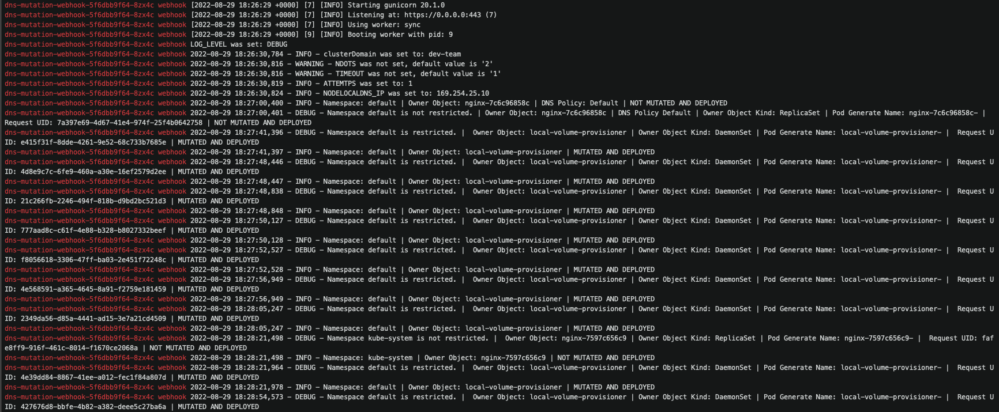

# kubernetes-dnsConfig-mutating-webhook
[](https://github.com/ugur99/kubernetes-dnsConfig-mutating-webhook/actions/workflows/docker-image.yml) [](https://github.com/ugur99/kubernetes-dnsConfig-mutating-webhook/actions/workflows/scan.yml)

This is a Kubernetes mutating webhook to manipulate `dnsConfig` and `dnsPolicy` dynamically.

If dnsPolicy is not specified or is set as ClusterFirst, the pod creation request is intercepted and mutated as the following:

```
  dnsConfig:
    nameservers:
    - 169.254.25.10
    options:
    - name: timeout
      value: "1"
    - name: ndots
      value: "2"
    - name: attempts
      value: "1"
    searches:
    - svc.dev-team
  dnsPolicy: None
```

`Ndots`, `attempts` and `timeout` values can be given as environment variables of the [backend container](kubernetes-manifests/webhook-mutation-deployment.yml). Since this architecture is designed for a cluster that uses `nodelocalDNS`, nodelocalDNS_IP should be set as an environment variable too. Backend reads clusterDomain which is assumed to be same as the cluster name from the [cluster-info configmap](kubernetes-manifests/cluster-info.yml). 

Namespaces which is wanted to be excluded can be given in the [configmap](kubernetes-manifests/mutating-webhook-cm.yml)

